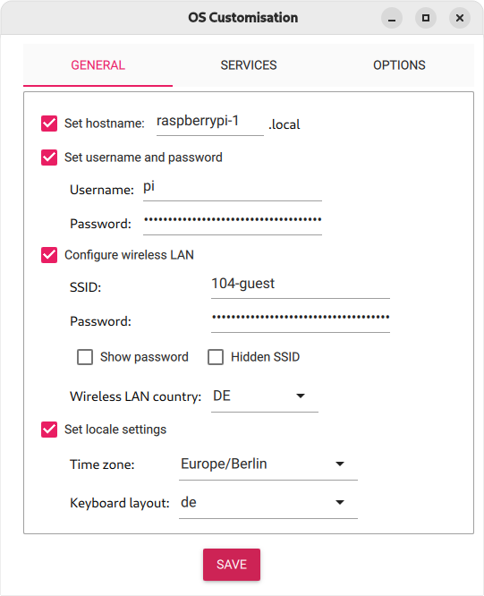

<div align="center">

#  Himbeer Verfolgung

A simple RFID demo using a Raspberry Pi and Python

<br/>

</div>


## 💡 About The Project

This is a very simplistic project to demonstrate the use of RFID technology.
It uses the [NXP MFRC-522 chip](https://www.nxp.com/docs/en/data-sheet/MFRC522.pdf) to communicate with [Mifare Classic EV1 1K](https://www.nxp.com/docs/en/data-sheet/MF1S50YYX_V1.pdf) RFID tags. 

It is intended to be used in the lecture "Soziotechnische Studien: Container, Paletten, Verpackungen" taught by Prof. Dr. Martin Binder at [PH-Weingarten](https://technik.ph-weingarten.de/das-fach/das-fach/).

The project can be used in conjunction with this [RESTful](https://github.com/ITBenni/himbeer-verfolgung-backend) backend and this [web frontend](https://github.com/ITBenni/himbeer-verfolgung-frontend). 


## Getting Started

This project consists of two components: a [hardware component](#raspberry-pi-setup) and a [software component](#software-setup).
To get this project up and running follow these steps.

### 🛒 Prerequisites

This project is intended to run on a Raspberry Pi.
You will need the following hardware: 

- [Raspberry Pi 3+/4/5](https://www.berrybase.de/en/raspberry-pi-4-computer-modell-b-4gb-ram)
- Micro SD Card (16GB)
- [RC522 RFID Modul](https://www.reichelt.de/entwicklerboards-rfid-modul-nxp-mfrc-522-debo-rfid-rc522-p192147.html)
- Breadboard Wire
- Breadboard


### 🥧 Raspberry Pi setup

#### Installation

Follow [this tutorial](https://www.raspberrypi.com/documentation/computers/getting-started.html) to setup your Pi up as a *headless* computer.

In the [Imager software](https://www.raspberrypi.com/software/) select *Raspberry Pi OS Lite (64-bit)* as operating system.
Edit the OS customization settings, so they look something like this:




Replace the *wireless LAN SSID* and *password* with the ones from your wireless network.

To access your Pi, either connect it to a monitor and keyboard, or use SSH to access it. 
In the later case, use these tutorials to connect to your Pi: [for Windows](https://www.raspberrypi.com/documentation/computers/remote-access.html#secure-shell-from-windows-10)/[for Mac](https://www.raspberrypi.com/documentation/computers/remote-access.html#secure-shell-from-linux-or-mac-os). 
To log in, use the username and password you configured in the Imager software. 

The ssh command should look like this:

```sh
ssh pi@raspberrypi-1.local
```

At the end of this step, you should have a command line in front of you where you can enter commands. 
You can check it by running the command `whoami` which shoud give you `pi` ;)


#### Configuration

To use the GPIO-pins of the Pi, use the [raspi-config tool](https://www.raspberrypi.com/documentation/computers/configuration.html#raspi-config) to [enable the SPI interface](https://www.raspberrypi.com/documentation/computers/configuration.html#spi) under [System Options](https://www.raspberrypi.com/documentation/computers/configuration.html#system-options). 

Shutdown your Pi to set up up the wiring using the following command:

```sh
sudo shutdown now
```


### 🪛 Hardware setup

Connect the RFID reader to your Pi. 
You can follow the [instructions in the original post](https://pimylifeup.com/raspberry-pi-rfid-rc522/#wiring-the-rfid-rc522).

It should look like this: 


This [Raspberry Pi pinout guide](https://pinout.xyz) might also be helpful. 

### 🧑‍💻 Software Setup

The following steps should all be completed on your Pi.

#### Prerequisites

This demo uses the [python programming language](https://docs.python.org/3/tutorial/index.html). 
It comes preinstalled on Raspbian OS, but running the demo requires a few additional tools. 
Install them using the following command: 

```sh
sudo apt install python3-dev python3-pip git
```

The two important tools used here are [pip](https://pip.pypa.io/en/stable/) and [git](https://git-scm.com/video/what-is-version-control). 

#### Installation

Download the sourcecode from this repository by running the following command:

```sh
git clone https://github.com/ITBenni/himbeer-verfolgung-rfid.git && cd himbeer-verfolgung-rfid
```

Install additional project dependencies by running:

```sh
pip install -r requirements.txt
```

This mainly install the python library necessary for interacting with the RF522 RFID module. 


## 🪱 Usage

The main program resides in [rfid.py](/rfid.py).
Run it using this command:

```sh
python3 rfid.py
```


## 🤝 Contributing

Any contributions are welcome :)
If you find any errors or if you have feedback, please open an [issue on Github](https://github.com/ITBenni/himbeer-verfolgung-rfid/issues).


## 📜 License

Distributed under the MIT License. See [LICENSE](LICENSE) for more information.


## 🙏 Acknowledgments

This project stands on the shoulders of giants. Those are: 

- [Ondřej Ondryá'š (ondryaso) RC522 python library](https://github.com/ondryaso/pi-rc522)
- [Angus Young's (gus-0) original post on PiMyLifeUp](https://pimylifeup.com/raspberry-pi-rfid-rc522/#wiring-the-rfid-rc522)
- [Mario Gómez's (mxgxw) RC522 python library](https://github.com/mxgxw/MFRC522-python)

Without these amazing people this project would't have been possible. 